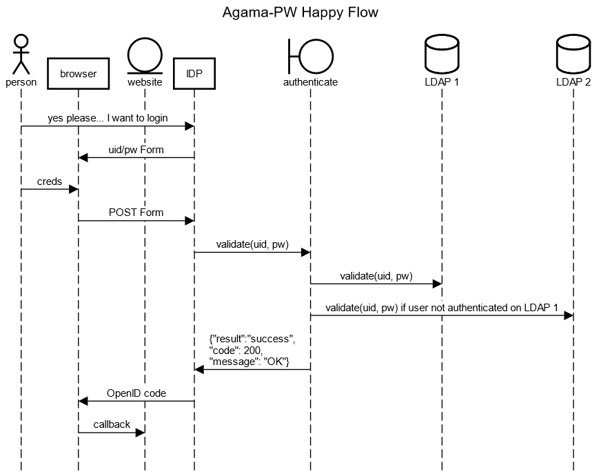

<p align="left">
  
</p>

[![Contributors][contributors-shield]](contributors-url)
[![Forks][forks-shield]](forks-url)
[![Stargazers][stars-shield]](stars-url)
[![Issues][issues-shield]](issues-url)
[![Apache License][license-shield]](license-url)

# Gluu agama-ldap

Welcome to the [https://github.com/GluuFederation/agama-ldap](agama-ldap) project.
This project is governed by [Gluu](https://gluu.org) and published under an
Apache 2.0 license. It provides various flows to password authenticate a person.

Password authentication is still useful ! ! !

This is also a great project to fork if you want to write
a “Hello World” Agama project.

## Implementations

* Jans Auth Server
* Gluu Flex

## Flow: One-step password authn

This is the classic combined username / password form authentication workflow.
The sequence diagram below shows the good flow.


[Source](https://sequencediagram.org/index.html#initialData=C4S2BsFMAIEEHMCGBbRBaACgdWgCUQA4ECe0AYuAPYDuAULYgMbCUBO0BkrAzpQHa0CiVqEYghfYNABGrGty61IksKWqRp3MJEHDR4xJOgBJACIZa0ygFc+AE2GlE14AAtloxMB0PgiaYgK0AAyprAY0ACMtL7+gTCh4dAATPScPPxoAHxmGABc0MSQ3BxQ8QB0lSbQ1IZSLNBU8CACudmy8lwF1iB2APQE1ORsyIJcvHztctQKrAWMrJB23JbTs9m5BRgA8gDKACrDrKNtWc5uHiCMXpAFAG6I4L03ABQ9dgA0HNQAlAwu7hU1282USEUi90ez28b16X0Gf3OgM8IKyYJSkKevkgsM+3x+0BAADNoNZZtA+JQpEjLsCltB+CEwuD6DSgTcNuYCgBvABEi241nAwF5eV5gsYjGK3F5HwAOnxeYxKHZIKKUgAGDXyxXIaWIeBqgq87YAaV5AF9aKcOjMutBtpw+GZoMrVatOqxsupNNp5o9wAFGABrIA)

# Flow Configuration
Below is a typical agama-ldap flow
  ```
{
    "org.gluu.agama.ldap.pw.main": {
        "lockConfig": {
            "MAX_LOGIN_ATTEMPT": 6,
            "ENABLE_LOCK": true,
            "LOCK_EXP_TIME": 180
        },
        "useInternalLdapConfig": false,
        "serversConfig": [
            {
                "configId": "ad_1",
                "bindDN": "cn=directory manager",
                "bindPassword": "encoded_password/plain_passowrd",
                "servers": ["localhost:1389"],
                "maxConnections": 3,
                "useSSL": false,
                "baseDNs": ["ou=people,o=jans"],
                "loginAttributes": ["uid"],
                "localLoginAttributes": ["uid"]
             },
             {
                "configId": "ad_2",
                "servers": ["localhost:2389"],
                "bindDN": "cn=directory manager",
                "bindPassword": "encoded_password/plain_passowrd",
                "useSSL": false,
                "maxConnections": 3,
                "baseDNs": ["ou=people,o=jans"],
                "loginAttributes": ["mail"],
                "localLoginAttributes": ["mail"]
             }
         ]
    }
}

  ```
- MAX_LOGIN_ATTEMPT: Is the maximum failed login attempt before the user account is locked
- ENABLE_LOCK: true/false, this is use to enable the Account Lock feature
- LOCK_EXP_TIME: The time in seconds befor a locked account is unlock.
- useInternalLdapConfig: Specify which LDAP configuration to use. `true` means that agama-ldap should use Jans Auth LDAP server configurations. `false` allow to specify LDAP configurations in `serverConfig` section.
- serversConfig: One or more LDAP server configurations

## TUI sample settings:

These are sample setting for `useInternalLdapConfig = true`:


> **Note**:
  The user must exist in both your local database and the remote LDAP server.
  If the user exists only in the remote LDAP, you can use the [Jans Link](https://docs.jans.io/head/janssen-server/link/) service to synchronize their data to the local database.


# License

This project is licensed under the [Apache 2.0](https://github.com/GluuFederation/agama-ldap/blob/main/LICENSE)


<!-- This are stats url reference for this repository -->
[contributors-shield]: https://img.shields.io/github/contributors/GluuFederation/agama-ldap.svg?style=for-the-badge
[contributors-url]: https://github.com/GluuFederation/agama-ldap/graphs/contributors
[forks-shield]: https://img.shields.io/github/forks/GluuFederation/agama-ldap.svg?style=for-the-badge
[forks-url]: https://github.com/GluuFederation/agama-ldap/network/members
[stars-shield]: https://img.shields.io/github/stars/GluuFederation/agama-ldap?style=for-the-badge
[stars-url]: https://github.com/GluuFederation/agama-ldap/stargazers
[issues-shield]: https://img.shields.io/github/issues/GluuFederation/agama-ldap.svg?style=for-the-badge
[issues-url]: https://github.com/GluuFederation/agama-ldap/issues
[license-shield]: https://img.shields.io/github/license/GluuFederation/agama-ldap.svg?style=for-the-badge
[license-url]: https://github.com/GluuFederation/agama-ldap/blob/main/LICENSE
